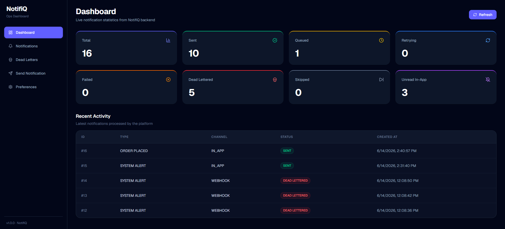
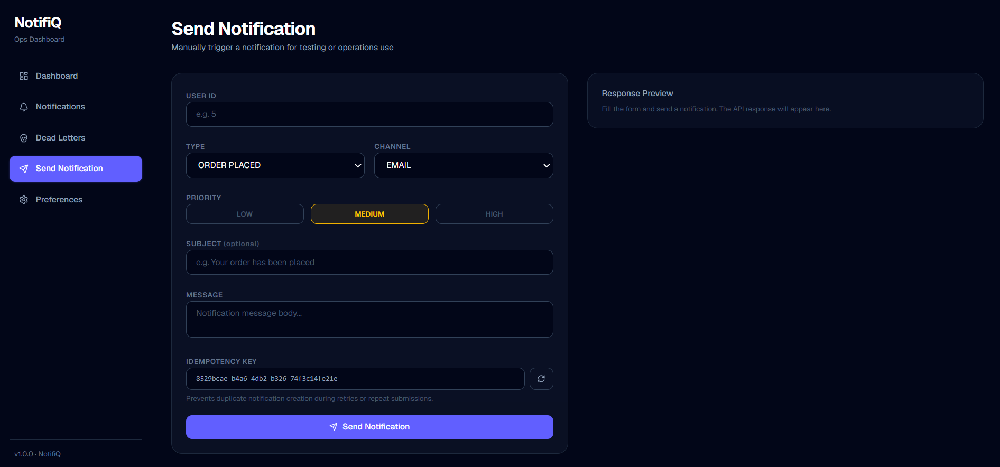
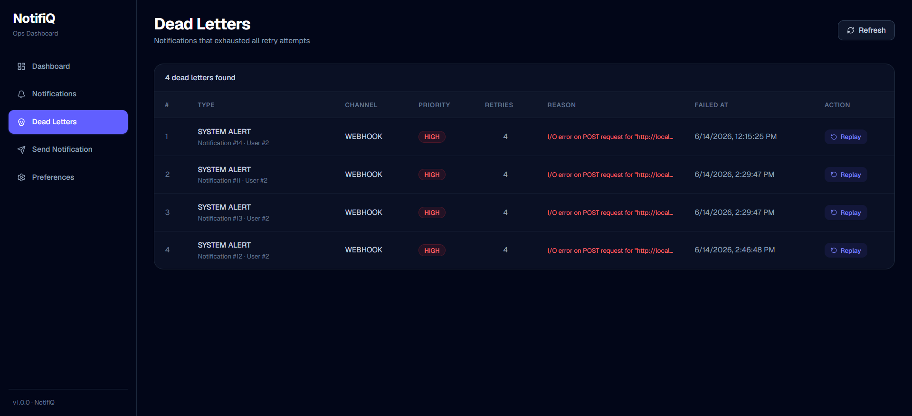
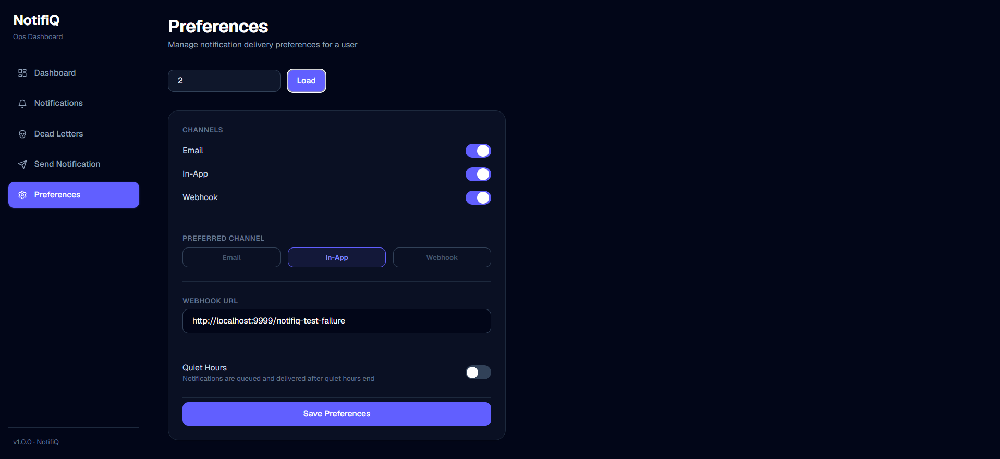

# NotifiQ Dashboard

Operations dashboard for **NotifiQ**, a reliable multi-channel notification delivery platform.

This React dashboard helps monitor notification delivery, inspect user notifications, replay dead-lettered notifications, send test notifications, and manage user delivery preferences.

---

## Features

- Dashboard with live notification statistics
- Recent notification activity view
- Search notifications by user ID
- Send notifications manually from the UI
- Support for Email, In-App, and Webhook channels
- Dead Letter Queue monitoring
- Replay failed notifications from DLQ
- User preference management
- Quiet hours configuration
- Webhook URL configuration
- Toast-based success/error feedback
- Environment-based backend API configuration

---

## Screenshots

### Dashboard



### Send Notification



### Dead Letter Replay



### User Preferences



---

## Tech Stack

- React
- TypeScript
- Vite
- Tailwind CSS
- Axios
- React Router DOM
- Lucide React

---

## Project Structure

```text
src/
├── api/
│   └── api.ts
├── components/
│   ├── Sidebar.tsx
│   ├── StatsCards.tsx
│   ├── RecentNotifications.tsx
│   ├── StatusBadge.tsx
│   ├── PriorityBadge.tsx
│   └── Toast.tsx
├── constants/
│   ├── routes.ts
│   └── navigation.ts
├── pages/
│   ├── Dashboard.tsx
│   ├── Notifications.tsx
│   ├── DeadLetters.tsx
│   ├── SendNotification.tsx
│   └── Preferences.tsx
├── services/
│   ├── notificationService.ts
│   ├── deadLetterService.ts
│   └── userService.ts
├── types/
│   └── types.ts
├── App.tsx
├── main.tsx
└── index.css
```

---

## Pages

### Dashboard

Shows high-level delivery metrics such as total notifications, sent notifications, queued notifications, retrying notifications, dead-lettered notifications, skipped notifications, and unread in-app notifications.

### Notifications

Allows searching notifications by user ID and viewing channel, status, priority, retry count, created time, and sent time.

### Dead Letters

Displays notifications that exhausted retry attempts and moved to the Dead Letter Queue. Operators can replay dead-lettered notifications back into the delivery flow.

### Send Notification

Provides a manual notification trigger form with support for notification type, channel, priority, subject, message, and idempotency key generation.

### Preferences

Allows managing user-level delivery preferences including enabled channels, preferred channel, webhook URL, and quiet hours.

---

## Backend Integration

This dashboard consumes REST APIs from the NotifiQ Spring Boot backend.

Main API areas used:

```text
GET   /api/notifications/stats
GET   /api/notifications/recent
GET   /api/notifications/user/{userId}
POST  /api/notifications
GET   /api/admin/dead-letters
POST  /api/admin/dead-letters/{id}/replay
GET   /api/users/{userId}/preferences
PUT   /api/users/{userId}/preferences
```

---

## Environment Variables

Create a `.env` file in the project root:

```env
VITE_API_BASE_URL=http://localhost:8080
```

For reference, keep `.env.example` committed:

```env
VITE_API_BASE_URL=http://localhost:8080
```

---

## Getting Started

### 1. Clone the repository

```bash
git clone https://github.com/Khushi340/notifiq-dashboard
cd notifiq-dashboard
```

### 2. Install dependencies

```bash
npm install
```

### 3. Configure environment

Create `.env`:

```env
VITE_API_BASE_URL=http://localhost:8080
```

### 4. Run the development server

```bash
npm run dev
```

The app will run at:

```text
http://localhost:5173
```

---

## Available Scripts

```bash
npm run dev
```

Starts the development server.

```bash
npm run build
```

Creates a production build.

```bash
npm run preview
```

Previews the production build locally.

```bash
npm run lint
```

Runs ESLint checks.

---

## Key Frontend Concepts Used

- Component-based page structure
- Centralized route constants
- Axios API instance
- Service layer for backend communication
- Strong TypeScript response types
- Reusable status and priority badges
- Reusable toast component
- Loading, success, empty, and error states
- Form state management
- Idempotency key generation using `crypto.randomUUID()`
- Conditional rendering for webhook and quiet hours settings

---

## Idempotency Key Handling

The Send Notification page generates an idempotency key using the browser API:

```ts
crypto.randomUUID();
```

This key is sent with every notification request to prevent duplicate notification creation during retries or repeated submissions.

---

## Related Repository

Backend repository: https://github.com/Khushi340/NotifiQ

---

## Status

Frontend feature development is complete.

Implemented pages:

- Dashboard
- Notifications
- Dead Letters
- Send Notification
- Preferences
